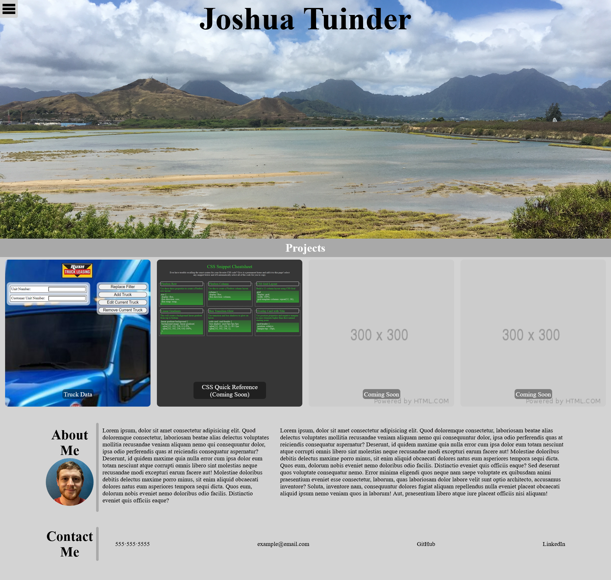

# Personal Website

## Portfolio and Information Page

As a developer, it's important to have a central place to link my projects and some basic information about myself.
I built this project to showcase my projects as well as grow my skills as a designer.
This project allows me to get my name out there and have an easier time networking as a dev.
I learned a few things about colors what what goes together vs. what doesn't.

## Installation

N/A

## Usage

Provide instructions and examples for use. Include screenshots as needed.

To add a screenshot, create an `assets/images` folder in your repository and upload your screenshot to it. Then, using the relative filepath, add it to your README using the following syntax:

[Deployed Application](https://www.joshuatuinder.com/)

## License

N/A

## Tests

To test functionality of this project, click on any of the valid project images and you'll be taken to the deployed apps.
The menu also has the same functionality with the added feature of bringing you to the "about me" and "contact me" sections of the page.
